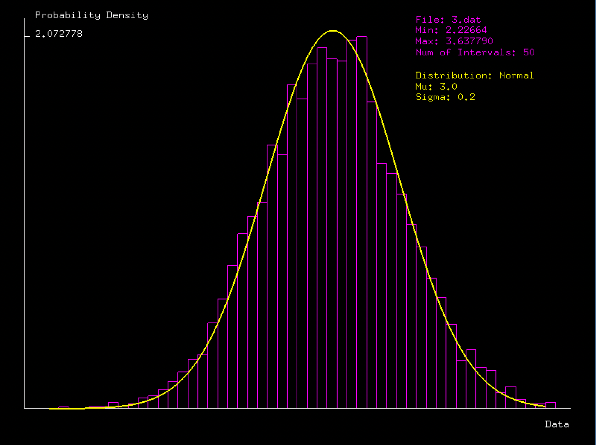
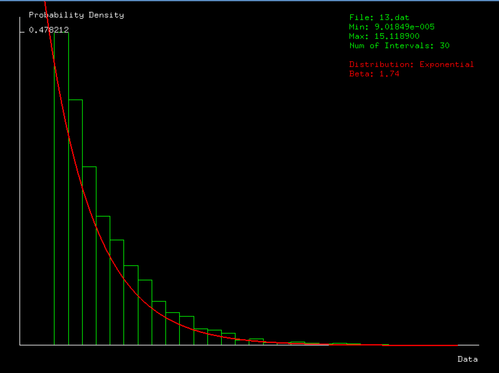

# Distributions Viewer

A simple executable utilizing the OpenGL framework in C/C++. The program will be able to generate a histogram and a distribution for a data set that is
read in from a file. The user will pass four different file names to the program during execution.The program will read in the data set from the file, and
a histogram will be generated for the Probability Density Function of the data set. The intervals of the histogram will all have the same width, and the
height is the area of each interval. The distribution of the data set is calculated next, and it will be displayed as a continuous line. The distributions
that will be used during the course of this program are the exponential and normal distributions. The theoretical distribution that has the best match to the
data set will be selected and displayed on the screen. The user will be have the option to change several parameters related to the program such as colors,
parameter step, file, distribution, and number of intervals.

## Examples

There are two datafiles provided with the project. One will generate a normal or gaussian distribution while the other creates an exponential distribution.

## Normal Distribution

## Exponential Distribution

